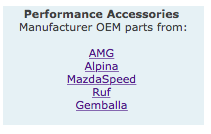

# Cars Sample App Readme

This is a simple web app which provides for a Super car store which has a couple of performance/code issues. The app can be build with Maven.

## Architecture

The app is based on a Angular 1 front end, calling back to RESTful services, base on [Jersey](https://jersey.java.net), with a [MySQL](https://www.mysql.com) back end.

There is also a iOS mobile app which uses the same REST endpoints. This app is described in it's own [README](mobile/iOS/README.md).

The internals of the web app are fairly simple. The packages in the code are:

* com.supercars - Contains classes to describe the different business entities, e.g. car, manufacturer etc.
* com.supercars.dataloader - Classes to access the DB and retrieve or persist the different business entities
* com.supercars.externaldata - Classes to retrieve data from 3rd party services of HTTP - This is where the fuel prices come from on the home page
* com.supercars.logging - Classes for custom logging, used to help with exercises for AppDynamics
* com.supercars.rest - Classes which exposes the REST services
* com.supercars.usermanagement - Classes for user management

### A JSP Page

There is one application page which isn't Angular, but is a standalone JSP page this is "/Cars_Sample_App/angular/tuner.jsp". This page is access using the links from the performance accessories section on the home page:

## Database

The app uses a MySQL DB in the backend, this be default is expected to be the "supercars" schema, and MySQL running locally to the app. The schema build is in src/main/resources/db/mysql.sql. Execute this script against the schema you create in MySQL.

The datasouce is defined in context.xml in src/webapp/META-INF

## Building

This app uses [Maven](https://maven.apache.org) for the build. To get a build environment working:

1. Have [git](https://git-scm.com) installed and working
1. Get [Maven](https://maven.apache.org) installed
	1. Get the tar.gz or zip package from the Maven site
	1. Unpack somewhere on your file system, e.g. "/opt/maven/apache-maven-3.3.9/"
	1. Add the Maven bin directory to your path, e.g. in "vi .bash_profile" add:
		<pre><code>
 		export M2_HOME=/opt/maven/apache-maven-3.3.9
 		export M2=$M2_HOME/bin
 		export PATH=$PATH:$M2
 		</code></pre>
	1. Login and out of your shell to get the new path
	1. Test using the command "mvn". This should run Maven and indicate "Build Failure"
1. Use git to get the source code
	<pre><code>
 	git clone https://github.com/tombatchelor/Cars_Sample_App.git
 	</code></pre>
1. Change to the Cars_Sample_App directory and then execute the following for the build
	<pre><code>
	mvn install
	</code></pre>
1. This should run and leave "Cars_Sample_App.war" in the "target/" directory

It is also possible to have Maven auto deploy right into Tomcat.

1. First step is to configure a user for the Tomcat Manager. In "$TOMCAT_HOME/conf/tomcat-users.xml" add a line line the following:
	<pre><code>
 	&lt;user username="user" password="pass" roles="manager-script,manager-gui"/&gt;
	</code></pre>
1. Restart Tomcat
1. Update our Maven config with this information. This is in the file "$M2_HOME/conf/settings.xml".
	1. Locate the "&lt;servers&gt;" tag
	1. Inside here add a server entry like the following:
	<pre><code>
	&lt;server&gt;
      &lt;id>Tomcat&lt;/id&gt;
      &lt;username>user</username&gt;
      &lt;password>pass</password&gt;
    &lt;/server&gt;
    </code></pre>
    1. Note that the user/pass must match what you set in the Tomcat config
1. Now go back to the Cars_Sample_App source. Instead of "mvn install", the following will build and deploy:
	<pre><code>
	mvn tomcat7:install
	</code></pre>
1. If the app is already deployed into the Tomcat the following will build and re-deploy
	<pre><code>
	mvn tomcat7:redeploy
	</code></pre>
1. Now the app is available on "/Cars_Sample_App/angular/index.jsp" on your Tomcat
	