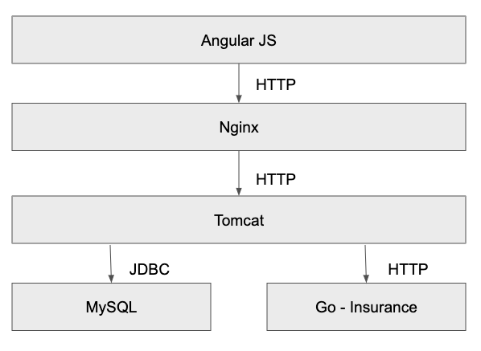

# Cars Sample App Readme

NOTE: If you are looking for the [AppDynamics](https://www.appdynamics.com) Cars App used for SE recruiting, this is now in its [own repo](https://github.com/Appdynamics/Cars_Sample_App).

This is a web app which provides for a Super car store which has a couple of performance/code issues. The app can be built with Maven and deployed into Kubernetes

## Quick Start

All containers are in DockerHub so deploying kuberneters/cars_app.yaml to a K8s cluster will get this up and running. Not the web-server is not exposed by default, this can easily be done with the following

`kubectl expose deployment cars-deployment-web --type=NodePort`

## Architecture

The app is based on an AngularJs front end, calling back to RESTful services, based on [Jersey](https://jersey.java.net), with a [MySQL](https://www.mysql.com) back end DB, [Nginx](https://www.nginx.com) proxy up front and a [Go](https://golang.org) based [Insurance Service](https://github.com/tombatchelor/car-insurance)

There is also a iOS mobile app which uses the same REST endpoints. This app is described in it's own [README](mobile/iOS/README.md).

## Repo Layout

Most of the code for the app is in this repo, the exception is the Go Insurance Service.

There are a number of directories in this repo for the other components, each has their own README describing the contents

* [web_server](web_server/) - Contains the web server config
* [app_server](app_server/) - All the code and config for the Tomcat layer, this is where the bulk of the code sits
* [db_server](db_server/) - Schema and container definition for MySQL
* [cron_cleanup](cron_cleanup/) - A CronJob that runs to clean up after the load test
* [JMeter](load_gen/) - Definition for the load testing
* [Demo Monkey](/demo_monkey/) - Demo Monkey scripts to skin the demo
* [kubernetes](kubernetes/) - Config for standing up the whole app in K8s
* [demo_marshaller](demo_marshaller/) - Container and app_server YAML files for cycling issues and scaling of app_server
* [prometheus](prometheus/) - Container def for collecting metrics
* [mobile/iOS](mobile/iOS/) - Mobile app for Cars
* [docimages]() - Just the images for the READMEs